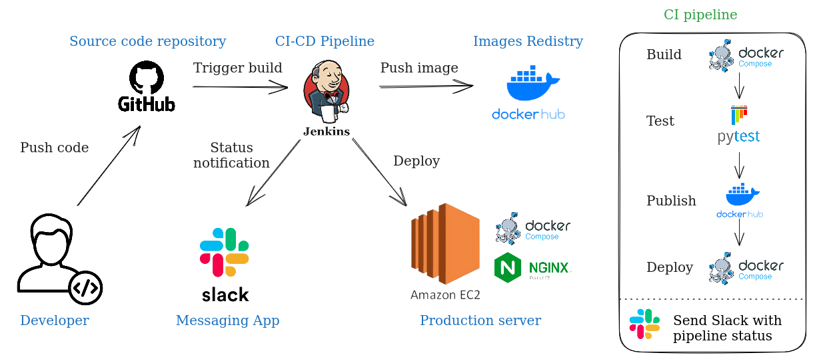

Jenkins Pipeline for Python Flask Weather Application with Docker Compose
======
Project Overview:
------
This project involves setting up a Jenkins pipeline to automate the build, testing, and deployment process of a Python Flask weather application. The pipeline utilizes Docker Compose for creating a child environment, runs unit tests, pushes the built image to a Docker repository, and deploys both the application and nginx to a remote virtual machine using a Docker daemon (docker -H).

